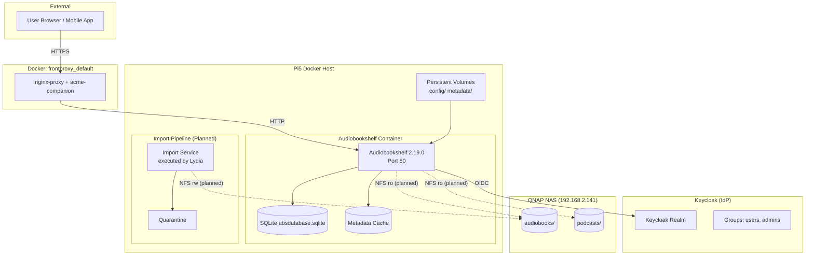

# Audiobookshelf — Architecture

## Service Boundary

Audiobookshelf is a dedicated audiobook and podcast serving application. It is **not** a general media server — video and music are served by Jellyfin. Audiobookshelf manages its own SQLite database, metadata cache, and playback state. Media files are read from NAS storage; write access is exclusively through a separate import pipeline.

## Runtime Placement

```
Runtime Host:  Raspberry Pi 5 (Pi5)
Orchestration: Docker Compose
Compose Authority: Homelab/Architecture (pi/compose/audiobookshelf.yml)
```

The Pi5 runs all Homelab Docker services. There is no separate Audiobookshelf host. The rechenknecht is not involved.

## Container Topology

```
┌───────────────────────────────────────────────────┐
│                   Pi5 Docker Host                   │
│                                                     │
│  ┌─────────────────────────────────────────────┐   │
│  │         Audiobookshelf Container             │   │
│  │  Image: ghcr.io/advplyr/audiobookshelf      │   │
│  │         @sha256:1eef6716...                  │   │
│  │  Version: 2.19.0 (pinned)                   │   │
│  │  Platform: linux/arm64                       │   │
│  │  Restart: unless-stopped                     │   │
│  │  Mem: 512m | CPU: 1.0                       │   │
│  │  Port: 80 (internal only)                   │   │
│  │  Health: GET /status → 200                   │   │
│  │                      interval 15s            │   │
│  │                                             │   │
│  │  Mounts:                                     │   │
│  │    /config        ← SSD (persistent)         │   │
│  │    /metadata      ← SSD (persistent)         │   │
│  │    /media/audiobooks  ← NAS (ro, future)     │   │
│  │    /media/podcasts    ← NAS (ro, future)     │   │
│  └──────────┬──────────────────────────┬───────┘   │
│             │                          │            │
│    ┌────────▼────────┐      ┌──────────▼───────┐   │
│    │ audiobookshelf_ │      │ frontproxy_default│   │
│    │ internal        │      │ (external network) │   │
│    │ (internal: true) │      │                   │   │
│    └─────────────────┘      └──────────┬───────┘   │
│                                        │            │
└────────────────────────────────────────┼────────────┘
                                         │
                              ┌──────────▼────────┐
                              │  nginx-proxy +     │
                              │  acme-companion    │
                              │  (frontproxy)      │
                              │  VIRTUAL_HOST:     │
                              │  audiobookshelf.   │
                              │  hl.maier.wtf      │
                              │  TLS: Let's Encrypt│
                              └──────────┬────────┘
                                         │
                                  Internet│
```

## Front Proxy Relationship

Audiobookshelf is not directly exposed to the network. All external traffic arrives via the frontproxy (nginx-proxy + acme-companion):

| Parameter | Value |
|---|---|
| VIRTUAL_HOST | `audiobookshelf.hl.maier.wtf` |
| VIRTUAL_PORT | `80` |
| LETSENCRYPT_HOST | `audiobookshelf.hl.maier.wtf` |
| LETSENCRYPT_EMAIL | `webmaster@maier.wtf` |
| vhost.d | `client_max_body_size 0`, WebSocket Upgrade/Connection headers |

Container joins `frontproxy_default` for ingress and `audiobookshelf_internal` for service isolation.

## Keycloak Relationship

```
                    ┌──────────────┐
                    │   Keycloak   │
                    │  (IdP)       │
                    └──┬───────────┘
                       │ OIDC Authorization Code Flow
                       │ Confidential Client
                       │ Scopes: openid, profile, email
                       │ Claims: sub, preferred_username,
                       │         email, groups
                       │ Groups: audiobookshelf-users,
                       │         audiobookshelf-admins
                       │
              ┌────────▼───────────┐
              │  Audiobookshelf    │
              │  (OIDC Relying     │
              │   Party)           │
              │                    │
              │  sub → persistent  │
              │  identity binding  │
              │                    │
              │  groups → role     │
              │  authorisation:    │
              │  ・users → guest   │
              │  ・admins → admin  │
              └────────────────────┘
```

Keycloak is the authoritative identity and authorisation source. Audiobookshelf enforces access control through OIDC claim mapping. No parallel local standard accounts (except break-glass `admin`). Group changes take effect at next login.

## NAS Relationship

```
NAS (QNAP, 192.168.2.141)
  └── NFSv3 exports:
        ├── audiobooks/  → /mnt/ro/nas_audiobooks  → /media/audiobooks  (ro)
        └── podcasts/    → /mnt/ro/nas_podcasts    → /media/podcasts    (ro)
```

The NFS mount is **not yet implemented**. The Audiobookshelf container currently runs without NAS media (only a local test library at `/media/testlibrary`). NFS mount is a planned child issue.

Audiobookshelf accesses media **read-only**. All write operations go through the separate import pipeline.

## NFS Boundary

| Layer | Path | Protocol | Status |
|---|---|---|---|
| NAS export | `audiobooks` | NFSv3 | Confirmed (exists on NAS) |
| NAS export | `podcasts` | NFSv3 | Confirmed (exists on NAS) |
| Pi5 mount | `/mnt/ro/nas_audiobooks` | NFSv3 | Planned |
| Pi5 mount | `/mnt/ro/nas_podcasts` | NFSv3 | Planned |
| Container mount | `/media/audiobooks` | Bind from host | Planned |
| Container mount | `/media/podcasts` | Bind from host | Planned |
| Container mount | `/media/testlibrary` | Local dir (SSD) | Deployed |

## Persistent Application Data

All persistent data lives on the Pi5 SSD at `/mnt/hardDrive/audiobookshelf/`:

| Directory | Contents | Persistence |
|---|---|---|
| `config/` | `absdatabase.sqlite`, `migrations/` | SSD |
| `metadata/` | `backups/`, `cache/` (covers, images, items), `logs/`, `streams/` | SSD |
| `metadata/cache/` | covers/, images/, items/ | SSD |
| `testlibrary/` | Empty test audiobook directory | SSD |

## Configuration and Metadata Storage

Configuration is managed through the Audiobookshelf web UI and stored in the SQLite database (`absdatabase.sqlite`). No external configuration files (except Docker Compose environment variables and secrets). The OIDC client secret is provided as a Docker runtime secret.

## Audiobook Media Storage

Audiobook media files live exclusively on the QNAP NAS. The Audiobookshelf container mounts them read-only via NFS. The media directory structure is defined by the NAS share layout, not by the Audiobookshelf container.

## Trust Boundaries

```
┌────────────────────────────────────────────────────┐
│                External (Internet)                  │
│  ┌──────────────┐    ┌────────────────────────┐    │
│  │ User Browser │    │ Mobile Client (app)     │    │
│  │ HTTPS        │    │ HTTPS                   │    │
│  └──────┬───────┘    └───────────┬────────────┘    │
│         │                        │                  │
│         └────────┬───────────────┘                  │
│                  │ TLS 1.2+                         │
└──────────────────┼──────────────────────────────────┘
                   │
  ┌────────────────▼─────────────────────────────┐
  │         Trust Boundary 1: DMZ/Proxy           │
  │  ┌────────────────────────────────────────┐   │
  │  │         frontproxy (nginx-proxy)        │   │
  │  │  TLS termination, HTTP→HTTPS redirect,  │   │
  │  │  WebSocket proxy                        │   │
  │  └──────────────────┬─────────────────────┘   │
  └─────────────────────┼─────────────────────────┘
                        │ HTTP (Docker internal)
  ┌─────────────────────▼─────────────────────────┐
  │        Trust Boundary 2: Application            │
  │  ┌────────────────────────────────────────┐   │
  │  │      Audiobookshelf Container            │   │
  │  │  OIDC token validation, authorisation   │   │
  │  │  SQLite database, playback state         │   │
  │  └────────────────────────────────────────┘   │
  └────────────────────────────────────────────────┘
```

- **External** to **Proxy**: TLS 1.2+, Let's Encrypt certificate, nginx-proxy termination.
- **Proxy** to **Audiobookshelf**: HTTP only (Docker internal network, unreachable from host network).
- **Audiobookshelf** to **Keycloak**: OIDC Authorization Code Flow over HTTPS.
- **Audiobookshelf** to **NAS**: Read-only NFSv3 (planned). NFS traffic is LAN-only.

## External and Internal Network Exposure

| Interface | Protocol | Port | Exposed | Authentication |
|---|---|---|---|---|
| Public web | HTTPS | 443 | Yes (via frontproxy) | Keycloak OIDC |
| Public API | HTTPS | 443 | Yes (via frontproxy) | OIDC Bearer token |
| Healthcheck | HTTP | 80 | Docker internal only | None |
| Container → Keycloak | HTTPS | 443 | Internal LAN | OIDC Client Secret |
| Container → NAS | NFSv3 | 2049 | Internal LAN | IP allowlist (assumed) |

No host ports are exposed. The container's port 80 is accessible only from `frontproxy_default` and `audiobookshelf_internal` networks.

## Operational Actors

| Actor | Role | Authentication | Scope |
|---|---|---|---|
| **Operator** | Human administrator | Keycloak (Michael) | Full admin, break-glass, deployment |
| **Slarti** | Control Plane agent | Keycloak service account | Planning, review, architecture |
| **Lydia** | Execution Plane agent | Keycloak service account | Import pipeline, deployment execution |
| **Eddie** | Merge authority | Gitea bot | PR merge, deployment orchestration |
| **Reviewer** | Human or AI reviewer | GitHub | Review package validation |
| **Family Member** | End user | Keycloak (audiobookshelf-users) | Read-only library access |

## Control Flow

### User Browsing Audiobooks

```
Browser → HTTPS → frontproxy → ABS Container → Keycloak OIDC → JWT
       → ABS validates JWT (issuer, audience, signature, expiry)
       → ABS maps groups → role (guest/admin)
       → ABS serves media from NAS (ro) via internal HTTP
```

### Import Pipeline (Planned)

```
Source Media → Drop Zone → Import Service (Lydia) → Normalisation
       → Duplicate Detection → Quarantine (if uncertain) / Library
       → Scan trigger → Audiobookshelf indexes new media
```

The import pipeline runs as a separate component (not inside the Audiobookshelf container). Media is written to the NAS via a controlled write path. After successful normalisation and verification, a library scan is triggered.

## Data Flow

### Media Read Path

```
NAS (audio files) → NFS → Pi5 mount → Docker bind mount
       → Audiobookshelf container → HTTP response → frontproxy → Client
```

### Metadata Write Path

```
Audiobookshelf Web UI / API → SQLite database (config/)
       → Metadata cache (metadata/cache/)
```

### Configuration Write Path

```
Audiobookshelf Web UI → SQLite database (absdatabase.sqlite)
```

### Backup Data Flow

```
Audiobookshelf config/ + metadata/ → Backup target (QNAP? NAS? TBD)
```

## Separation: Deployment vs. Media Migration

These are two distinct concerns with different risks:

| Concern | Scope | Risk | Status |
|---|---|---|---|
| **Deployment** | Docker service, proxy, TLS, OIDC | Low (no data) | Partially deployed |
| **Media Migration** | NAS mount, import pipeline, normalisation | Medium (data integrity) | Not started |

Deployment must be complete and verified before media migration begins. The import pipeline is designed to be non-destructive and reversible.

## Mermaid Component Diagram



Note: The import pipeline, NFS mounts and quarantine are planned but not yet implemented.
