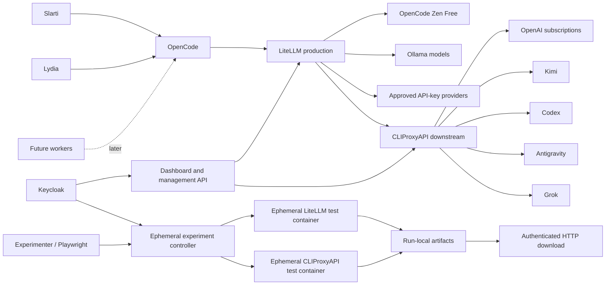

# Architecture

## Runtime topology

## Trust boundaries

1. OpenCode is the only normal model client endpoint consumer and connects exclusively to LiteLLM.
2. LiteLLM holds model-provider credentials for Zen Free and approved API-key providers. It never receives CLIProxyAPI-internal credentials.
3. CLIProxyAPI is private infrastructure reachable only by LiteLLM and approved operator paths. OpenCode clients do not receive CLIProxyAPI credentials.
4. Production provider credentials are available only to their respective gateway service (LiteLLM or CLIProxyAPI) and never to experiment containers.
5. Keycloak controls dashboard, management API and experiment authorization.
6. Runtime telemetry is persistent production state but remains outside Git; only schema, migrations, aggregation logic and compact approved summaries are versioned.
7. Experiment artifacts are run-local, ephemeral and confined to the canonical run directory.

## Production data paths

- Incoming OpenCode request is authenticated by a per-client LiteLLM credential.
- Task classification is accepted, challenged upward or generated when absent.
- LiteLLM routes directly for Zen Free and Ollama targets; subscription/CLI/OAuth-bound requests are forwarded to CLIProxyAPI.
- Released global governance and approved project-local additions produce the candidate set.
- Account state, quota, backoff, stickiness and quality metrics select provider, model and account at each gateway layer.
- Routing audit records assignment metadata only: task, class, model, provider, gateway, governance version, override/fallback and reason.
- Prompts, responses, secrets and account identifiers are not persisted by planning contract.

## Experiment control plane

The experiment controller owns lifecycle and package delivery. Test containers are created only for a run, receive isolated fixtures and spoofable non-production state, and cannot access production secrets. Both LiteLLM and CLIProxyAPI experiment containers write only beneath `experiments/<run-id>/`. On finalization, the directory becomes immutable, is packaged as `cliproxyapi-experiment-<run-id>.tar.gz` and exposed through an authenticated download endpoint until explicit finish or idle/retention expiry.

## Management roles

### `operator`

May enable or disable providers, lock or unlock individual production accounts, inspect routing state across both gateways, diagnose degraded mode, trigger backup, authorize run-specific concurrency and duration overrides, extend or reactivate experiment runs and use simulator spoofing.

### `test-service`

May use the simulator, versioned fixtures, Playwright test endpoints, reset isolated test state and set spoofed quota/provider/telemetry state. It cannot affect production state.

### Authenticated user

May execute read-only real-state dry-runs without spoofing.

## Decision engine

The dashboard and dry-run API use the same routing engine as production. With identical normalized input, governance and effective system state, the result is deterministic and includes a stable Decision Hash. The hash changes only when the effective routing decision changes.

## Resilience

Production LiteLLM and CLIProxyAPI may independently enter maintenance or degraded state. LiteLLM degraded mode blocks CLIProxyAPI routing and governance updates but continues Zen Free and Ollama inference. CLIProxyAPI degraded mode affects only subscription/OAuth backends. Planned maintenance returns HTTP 503 with machine-readable `maintenance` and `Retry-After` when known. Only Operator-authorized outage/security production hotfixes are allowed until a successful backup clears degraded state.
