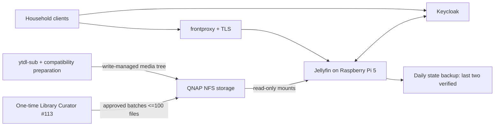

# Architecture

## Components

## Placement
- Runtime: Raspberry Pi 5, Docker, ARM64.
- Media storage: QNAP over NFS.
- Mount contract: `/mnt/ro/jellyfin/<library>` on the Pi and read-only inside the container.
- Libraries are created during implementation; planning does not claim they exist already.
- Container joins the existing `frontproxy` network.

## Library taxonomy
- `movies`
- `series`
- `music`
- `music-videos`
- generated `youtube-<audience-set>` libraries

There is no home-video library. Mixed-content libraries are prohibited.

## Playback model
- Prefer Direct Play, then Direct Stream.
- Pi software transcoding is an unguaranteed fallback.
- No NAS or remote transcoding worker.
- For downloaded videos, an offline compatibility rendition may coexist with the best-quality original only when required.
- Jellyfin must group original and compatibility rendition as versions of one item.

## Future migration
State, paths and Compose configuration must remain portable. Jellyfin is the first service moved to a future stronger always-on host. After validated migration, reproducible Pi-specific renditions may be removed through an approved cleanup plan.

## Trust boundaries
- Keycloak: identity, roles and authorization source of truth.
- Jellyfin: playback and local application state, not identity authority or media mutator.
- ytdl-sub/import tooling: controlled writer to YouTube media trees.
- Curator #113: one-time controlled migration/cleanup writer.
- NAS: canonical media storage.
- GitHub plan: design authority only.
- Gitea `Homelab/Architecture`: deployed-state authority.
