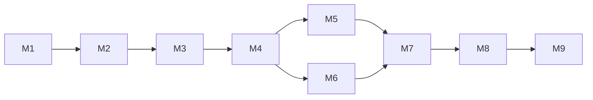

# Roadmap

## Milestones

### JF-M1 — Architecture and prerequisites
Confirm deployed-state facts, NFS export details, frontproxy integration, Keycloak capability and ARM64 image/plugin compatibility.

Runtime reconciliation: the Pi host, pinned ARM64 image, read-only container mounts and reachable HTTPS endpoint are evidenced. NFS export details, mount fail-closed behavior and Keycloak/plugin compatibility remain unproven.

### JF-M2 — Safe vertical slice
Deploy Jellyfin on Pi with one synthetic/read-only test library, proxy, SSO, break-glass and fail-closed mount protection. No production media migration.

Runtime reconciliation: deployment, proxy/TLS, controlled synthetic media, synthetic accounts, restricted-library denial and a passing playback smoke are evidenced. SSO and fail-closed mount startup are not yet evidenced.

### JF-M3 — Authorization model
Implement Papa admin, parents/curators, age tiers, unrated fail-closed behavior, permanent revocable grants and 18th-birthday transition.

### JF-M4 — Core libraries
Create films, series, music and music-video libraries under the stable mount contract. Music is globally visible.

### JF-M5 — Controlled migration
Execute #113 cleanup/migration in approved batches of at most 100 files. Preserve source until verification and operator acceptance.

### JF-M6 — YouTube archive
Implement versioned Channel-ID registry, request/approval workflow, audience-set libraries, ytdl-sub synchronization and conditional compatibility renditions.

### JF-M7 — Operations and acceptance
Enable monitoring, daily two-generation backup, restore testing, client playback matrix and incident runbooks.

Runtime reconciliation: two verified configuration backup archives and the closeout smoke evidence exist. Retention enforcement, restore to a replacement host, monitoring, and the complete client matrix remain open.

### JF-M8 — Production acceptance
Complete independent review, freeze the execution manifest, record evidence and approve production operation.

### JF-M9 — Future host migration
When stronger always-on hardware exists, migrate Jellyfin first, validate hardware transcoding/client behavior, then optionally remove Pi-specific compatibility renditions.

## Dependency graph

